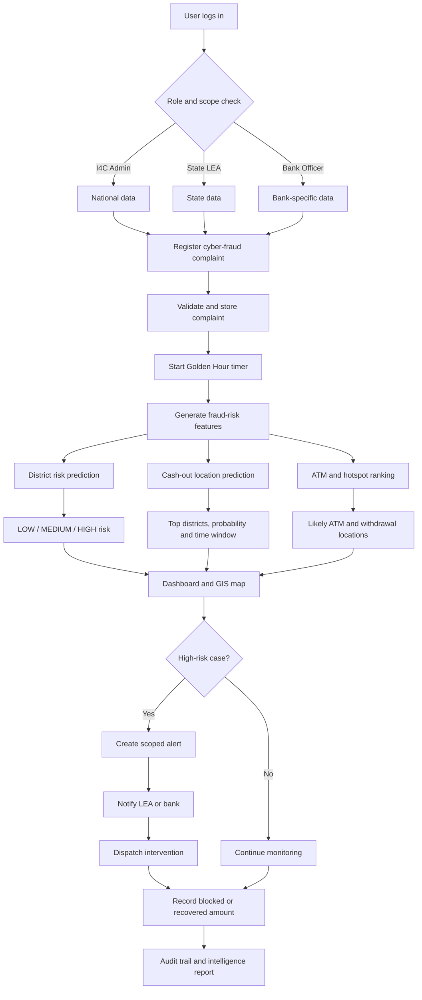

# VIZHI

**Predict. Prevent. Protect.**

VIZHI is a predictive cyber-fraud intelligence platform built for **Smart India Hackathon problem statement 26184** from the Indian Cyber Crime Coordination Centre (I4C), Ministry of Home Affairs. It converts cybercrime complaints and historical cash-out behavior into ranked withdrawal-location forecasts, operational time windows, risk maps, and jurisdiction-aware alerts.

The included demonstration is a **Tamil Nadu pilot with a national-ready architecture**. All supplied data is synthetic.

## What VIZHI does

When a financial cybercrime complaint is registered, VIZHI:

1. Starts the Golden Hour clock.
2. Finds historical complaint-to-cash-out patterns for the origin district.
3. Returns the top likely withdrawal districts and time buckets for the next 6–72 hours.
4. Ranks candidate ATMs using district, bank, and transport-hub signals.
5. Estimates the amount at risk and explains the district-risk indicators.
6. Raises an alert for the relevant I4C, LEA, or bank scope.
7. Produces an evidence-grounded intelligence brief for investigators.



## Operational workflow

1. **Login and access control**  
   The user logs in as an I4C Admin, State LEA, or Bank Officer. VIZHI uses JWT authentication and only exposes information permitted by the user's role and jurisdiction.

2. **Complaint registration**  
   An officer enters the victim's district, fraud type, bank, amount, reporting time, and other available case details.

3. **Golden Hour activation**  
   VIZHI immediately measures the time elapsed since the incident and prioritizes recent, high-value complaints requiring rapid intervention.

4. **Prediction engine**
   - Predicts the most likely cash-out districts.
   - Produces Top-1, Top-3, or Top-5 destination probabilities.
   - Estimates the likely withdrawal time bucket within the next 6-72 hours.
   - Ranks candidate ATMs using district, bank, historical, and transport-hub signals.
   - Classifies district risk as `LOW`, `MEDIUM`, or `HIGH`.

5. **Visual intelligence**  
   Results appear on the operational dashboard, prediction table, GIS map, hotspot layers, fraud network, and mule-flow diagram.

6. **Alert generation**  
   High-risk cases generate jurisdiction-aware alerts. Duplicate notifications are prevented using database-backed de-duplication, with Redis acceleration when configured.

7. **Coordinated response**  
   Authorized LEA or I4C users can dispatch an intervention to the relevant district, police unit, or bank.

8. **Investigation support**  
   Investigators can generate an intelligence brief, query the grounded assistant, examine linked mule accounts, and export a PDF report.

9. **Outcome and feedback**  
   Officers record whether money was blocked or recovered. The outcome is saved with an audit trail and can be used during later evaluation and retraining.

## Implemented capabilities

- Live complaint intake with immediate 48-hour case forecast
- Per-complaint top cash-out districts, ATM candidates, probabilities, and time buckets
- District-level risk ranking with 24/48/72-hour operational horizons
- Time-based XGBoost evaluation and SHAP-style explanations
- Temporal Top-1/3/5 cash-out destination evaluation
- DBSCAN withdrawal hotspot detection
- GIS map with complaint, withdrawal, ATM, and hotspot layers
- Complaint-volume forecasting
- Golden Hour prioritization
- Complaint DNA clustering
- Cross-complaint mule-account network analysis
- Mule migration Sankey flow
- Re-victimization indicators
- JWT authentication and role-based data scope
- I4C Admin, State LEA, and Bank Officer roles
- Authenticated, scope-aware WebSocket alerts
- Persistent database de-duplication with optional Redis acceleration
- In-app alerts plus configurable SMTP, SMS webhook, and API webhook delivery
- Audit logs and downloadable PDF intelligence briefs
- Responsive, accessible white-theme React interface
- SQLite zero-configuration mode and PostgreSQL/PostGIS Docker mode

## Technology stack

| Layer | Technology |
|---|---|
| Frontend | React 18, Vite, Tailwind CSS, Recharts, Leaflet, D3 |
| Backend | FastAPI, SQLAlchemy, Pydantic |
| Machine learning | XGBoost, scikit-learn, SHAP, statsmodels, NetworkX |
| Geospatial | DBSCAN/Haversine, Leaflet; PostGIS-ready persistence |
| Storage | SQLite locally; PostgreSQL/PostGIS in Docker |
| Alert de-duplication | Database fallback; Redis when configured |
| Intelligence assistant | Grounded offline templates; optional Anthropic API enrichment |

## Repository structure

```text
VIZHI/
├── backend/
│   ├── app/
│   │   ├── agent/          # Grounded intelligence brief generation
│   │   ├── alerts/         # Delivery, de-duplication, WebSockets
│   │   ├── auth/           # JWT, roles, jurisdiction filters
│   │   ├── ml/             # Features, models, clustering, graph analytics
│   │   └── routers/        # FastAPI endpoints
│   ├── artifacts/          # Trained models and metrics
│   ├── tests/
│   ├── train.py
│   └── requirements.txt
├── frontend/
│   └── src/
│       ├── components/
│       ├── pages/
│       └── theme/
├── Datasets/               # Five synthetic CSV datasets
├── docker-compose.yml
└── .env.example
```

## Dataset inventory

| File | Rows | Purpose |
|---|---:|---|
| `complaints.csv` | 20,000 | Complaint origin, type, amount, bank, and reporting time |
| `withdrawals.csv` | 20,601 | Ground-truth cash-out district, location, amount, and lag |
| `atm_locations.csv` | 300 | Candidate ATM/branch coordinates and nearby landmarks |
| `mule_accounts.csv` | 2,500 | Mule-to-complaint linkages and transaction summaries |
| `district_risk_labels.csv` | 636 | Weekly district risk labels |

The data spans 12 Tamil Nadu districts from September 2024 through August 2025. It is synthetic and intended for demonstration and model development only.

## Quick start: Docker

Prerequisites: Docker Desktop with Compose.

```bash
copy .env.example .env
docker compose up --build
```

Open:

- Application: <http://localhost:8080>
- API documentation: <http://localhost:8000/docs>
- Health check: <http://localhost:8000/health>

The backend creates the schema, ingests the CSV files on an empty database, seeds demo users, and loads the trained artifacts automatically.

## Quick start: local development

### Backend

Python 3.11 or newer is recommended.

```bash
cd backend
python -m venv .venv
.venv\Scripts\activate
pip install -r requirements.txt
python -m app.ingest
python seed_users.py
python train.py
uvicorn app.main:app --reload --port 8000
```

On macOS/Linux, activate the environment with `source .venv/bin/activate`.

### Frontend

```bash
cd frontend
npm ci
npm run dev
```

Open <http://localhost:5173>. Vite proxies `/api` and alert WebSockets to FastAPI on port 8000.

## Demo accounts

| Role | Username | Password | Scope |
|---|---|---|---|
| I4C Admin | `admin` | `admin123` | National |
| State LEA | `tn_lea` | `lea123` | Tamil Nadu |
| Bank Officer | `hdfc_officer` | `bank123` | HDFC |
| Bank Officer | `sbi_officer` | `bank123` | SBI |

These credentials are for the SIH demonstration only. Change the JWT secret and remove demo passwords before any real deployment.

## Important API endpoints

| Method | Endpoint | Purpose |
|---|---|---|
| `POST` | `/auth/login` | Authenticate and receive access/refresh tokens |
| `POST` | `/complaints` | Register a live complaint and receive a forecast |
| `GET` | `/complaints` | Scoped, filterable complaint list |
| `POST` | `/predict` | District risk ranking for an operational horizon |
| `POST` | `/predict/case` | Forecast cash-out locations for one complaint |
| `GET` | `/heatmap` | Scoped hotspot zones |
| `GET` | `/map/layers` | Complaint, withdrawal, and ATM map layers |
| `GET` | `/golden-hour` | Time-critical complaints |
| `GET` | `/graph` | LEA-only fraud network |
| `GET` | `/mule-flow` | LEA-only cross-state mule flow |
| `POST` | `/agent/query` | Grounded investigator query |
| `POST` | `/alerts/dispatch` | LEA/admin intervention dispatch |
| `GET` | `/alerts/capabilities` | Available notification providers |
| `POST` | `/complaints/{id}/outcomes` | Record blocking/recovery feedback |
| `WS` | `/ws/alerts?token=...` | Authenticated scoped live alerts |

Example case forecast:

```json
POST /predict/case
{
  "complaint_id": "CMP-20240901-00001",
  "window_hrs": 48,
  "top_k": 3
}
```

## Models and evaluation

The district-risk model predicts the following week's LOW/MEDIUM/HIGH risk using a time-based holdout rather than a random split. Current persisted metrics are:

- Macro F1: `0.612`
- HIGH-class F1: `0.708`
- Precision@5: `0.618`

At runtime, VIZHI also calculates temporal holdout metrics for the actual withdrawal-destination task:

- `cashout_top_1_accuracy`
- `cashout_top_3_accuracy`
- `cashout_top_5_accuracy`
- `cashout_eval_pairs`

The case forecaster combines historical origin-to-destination transitions with ATM operational ranking. This is deliberately described separately from the district-risk classifier so the demo does not misrepresent one metric as another.

Retrain after changing datasets:

```bash
cd backend
python train.py --ingest --k 5
```

## Alerts and external providers

In-app alerts work without configuration. Copy `.env.example` to `.env` and configure any optional provider:

- SMTP: `SMTP_HOST`, credentials, sender, and recipient
- SMS: `SMS_WEBHOOK_URL` accepting VIZHI's JSON alert payload
- External integration: `ALERT_WEBHOOK_URL`
- Redis: `REDIS_URL` for fast distributed de-duplication

If a provider is not configured, the UI disables that channel instead of pretending it was delivered.

## Security model

- Access and refresh JWTs are distinct.
- Every protected REST endpoint resolves the current user from the database.
- State LEAs are restricted to their configured state.
- Bank officers are restricted to their bank's complaints and relevant analytics.
- Cross-bank fraud graphs and field-team dispatch are restricted to LEA roles.
- WebSocket subscriptions require an access token and filter pushed alerts by state/bank.
- Agent queries are scoped before model context is constructed.
- Every operational query and dispatch is audit-logged.

For a production deployment, use a secrets manager, HTTPS, short-lived access tokens, refresh-token rotation, rate limiting, provider-specific signing, database encryption, and an approved government identity provider.

## Verification

Backend:

```bash
cd backend
pytest -q
```

Frontend:

```bash
cd frontend
npm run build
```

## Recommended SIH demonstration

1. Log in as the Tamil Nadu LEA using the `tn_lea` demonstration account.
2. Open **Complaints** and register a sample UPI fraud.
3. Show the generated complaint ID, Top-3 predicted cash-out districts, probabilities, time windows, and expected amounts.
4. Open **Dashboard** and explain the Golden Hour, district risk, and map layers.
5. Open **Predictions** and compare the 24/48/72-hour operational horizons.
6. Show the predicted cash-out locations, ATM candidates, and hotspots on the GIS map.
7. Open **Alerts**, dispatch an intervention, and explain database/Redis de-duplication.
8. Open **Fraud Graph** and explain that syndicates are detected using complaint linkages—not merely a shared bank.
9. Generate an intelligence brief and export it as a PDF.
10. Record the blocked or recovered amount as the complaint outcome.
11. Log in as a bank officer to demonstrate bank-restricted data visibility.

## Prototype limitations

- The included data is synthetic and Tamil Nadu-only.
- ATM ranking uses historical and landmark signals; it is not a guarantee of physical cash-out.
- Complaint DNA currently uses structured complaint attributes because narratives and hashed device/UPI identifiers are not present in the supplied dataset.
- Real NCRP/CFCFRMS integration requires official APIs, schemas, security review, and data-sharing approval.
- The intelligence assistant must remain advisory; intervention decisions require authorized human review.

## Problem statement

- **ID:** 26184
- **Organization:** Ministry of Home Affairs
- **Department:** Indian Cyber Crime Coordination Centre (I4C), CIS Division
- **Goal:** Predict likely cash-withdrawal locations early enough to support proactive coordination between law enforcement agencies and financial institutions.
